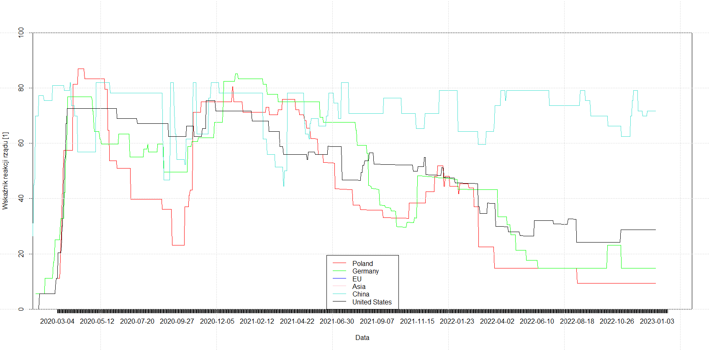

## Analiza Danych COVID-19

W pracy analizujemy statystyczne aspekty danych zakażeń i śmiertelności COVID-19, szukając korelacji z wskaźnikami rozwoju państw, m.in.: wskaźnikiem rozwoju społecznego (HDI), PKB, ilością łóżek szpilalnych oraz wskaźnikiem reakcji rządów [[1](https://ourworldindata.org/covid-stringency-index#learn-more-about-the-data-source-the-oxford-coronavirus-government-response-tracker)]. Przedstawiamy także wizualizację wyników na interaktywnej mapie.

## Źródła Danych:

-   [a] Dane OWID: <https://github.com/owid/covid-19-data/tree/master/public/data>, <https://ourworldindata.org/coronavirus> (wraz z wieloma kategoriami wskaźników)

-   [b] Dane WHO: <https://covid19.who.int/data>

-   [c] Dane geoJSON: <https://raw.githubusercontent.com/python-visualization/folium/master/examples/data/world-countries.json>

## Selekcja Danych:

Wybrane przez nas dane [a] pochodzą z Johns Hopkins University. Są zbiorem statystyk dotyczących zakażeń, śmiertelności oraz wykonywanych testów wraz z częściowo opracowanymi danymi (statystyki przeliczone na milion obywateli itp.). Dołączone są również liczne wskaźniki, które wykorzystujemy w naszej analizie.

Dane [b] pochodzą z oficjalnych zasobów Światowej Organizacji Zdrowia. Zawierają one dane raportowane w ciągu ostatnich 7 dni. Wykorzystujemy je przy tworzeniu interaktywnej mapy [c].

## Analiza w R:

Import bibliotek i danych, formatowanie dat, chronologiczne posortowanie:

```{r}
library(dplyr)
library(tidyr)

# source data from web (pre-downloaded), reformat date, sort by date
all_data <- read.csv("owid-covid-data.csv")
all_data$date <- as.Date(all_data$date)
all_data <- all_data[order(all_data$date, decreasing=TRUE),]
```

Filtrowanie danych, wydobycie informacji o państach:

```{r}
# get countries data, such as poverty, gpd, no of hospital beds, etc.
country_data <- all_data %>% distinct(all_data$location, .keep_all = TRUE)

# change parameters of ordering in order to generate desired plot
ordered_data <- country_data[order(country_data$human_development_index, decreasing=FALSE),]

```

Wykresy korelacji ilości zakażeń (bądź śmiertelności) i danego wskaźnika (opisanego na osi X):


Filtrowanie i grupowanie danych względem kontynentów:

```{r}
# data of continents
Continents_data <- rbind(head(all_data[all_data$location == "Asia", ], n=1), head(all_data[all_data$location == "Europe", ], n=1))
Continents_data <- rbind(Continents_data, head(all_data[all_data$location == "North America", ], n=1))
Continents_data <- rbind(Continents_data, head(all_data[all_data$location == "South America", ], n=1))
Continents_data <- rbind(Continents_data, head(all_data[all_data$location == "Oceania", ], n=1))
Continents_data <- rbind(Continents_data, head(all_data[all_data$location == "Africa", ], n=1))

#get desired indicator from continents
Continents_index <-  c(mean(all_data[all_data$continent == "Asia", ]$total_tests_per_thousand,na.rm=TRUE),
                                  mean(all_data[all_data$continent == "Europe", ]$total_tests_per_thousand,na.rm=TRUE),
                                  mean(all_data[all_data$continent == "North America", ]$total_tests_per_thousand,na.rm=TRUE),
                                  mean(all_data[all_data$continent == "South America", ]$total_tests_per_thousand,na.rm=TRUE),
                                  mean(all_data[all_data$continent == "Oceania", ]$total_tests_per_thousand,na.rm=TRUE),
                                  mean(all_data[all_data$continent == "Africa", ]$total_tests_per_thousand,na.rm=TRUE))

Continents_data["total_tests_per_thousand"] <- Continents_index

```

Wykres słupkowy podsumowujący powyższe grupowanie:

```{r}
# plot barplots showing continent statistics
par(mfrow=c(2,1))
barplot(Continents_data$total_deaths_per_million, names.arg = Continents_data$location, main="Śmiertelność w przeliczeniu na milion mieszkańców")
grid()
barplot(Continents_data$total_cases_per_million, names.arg = Continents_data$location, main="Ilość Zakażeń w przeliczeniu na milion mieszkańców")
grid()
```


Wartą zauważenia jest różnica dwóch wykresów dla danych z rejonu Oceani.

Średni wiek oraz procent populacji powyżej 70 r.ż. na poszczególnych kontynentach:

```{r}
Continents_data$median_age
```

    30.79245 42.08023 33.01833 30.23393 28.40721 21.09793

```{r}
Continents_data$aged_70_older
```

    4.147668 11.785805  6.168543  5.198921  4.788252  2.185749

Wspólny wykres łącznej sumy zachorowań dla kilku wybranych regionów:

```{r}
# get some subjective-picked regions 
poland_data <- all_data[all_data$location == "Poland", ]
germany_data <- all_data[all_data$location == "Germany", ]
EU_data <- all_data[all_data$location == "Europe", ]
ASIA_data <- all_data[all_data$location == "Asia", ]
china_data <- all_data[all_data$location == "China", ]
usa_data  <- all_data[all_data$location == "United States", ]


par(mfrow=c(1,1))
plot(poland_data$date,poland_data$stringency_index , type="l", xaxt="n", col="red", ylim=c(0,100), xlab="Data", ylab = "Wskaźnik reakcji rządu [1]") # basic plot
axis(1, poland_data$date, format(poland_data$date), cex.axis = 1)
lines(germany_data$date,germany_data$stringency_index, col="green") # basic plot
lines(EU_data$date,EU_data$stringency_index, col="blue") # basic plot
lines(ASIA_data$date,ASIA_data$stringency_index, col="pink") # basic plot
lines(china_data$date,china_data$stringency_index, col="turquoise") # basic plot
lines(usa_data$date,usa_data$stringency_index, col="black") # basic plot
grid()
legend("bottom", legend=c("Poland", "Germany", "EU", "Asia", "China", "United States"),
       col=c("red", "green", "blue", "pink", "turquoise", "black"),lty=1)

```


Porównanie wskaźnika reakcji rządów [[1](https://ourworldindata.org/covid-stringency-index)]:


